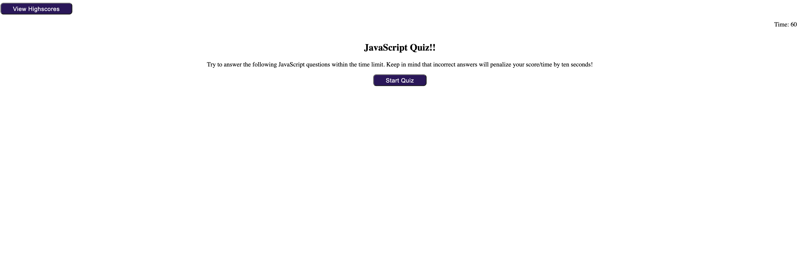
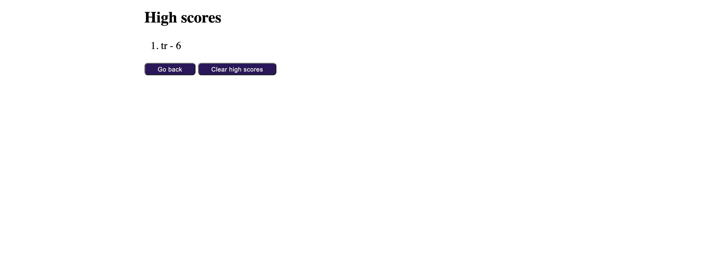

# JS-Timed-Quiz

## Description

A Javascript quiz with a time limit that decreases by ten when answered incorrectly. The user will be able to see all of their high scores and clear list.  

## Start Quiz Page

## Questions

## Final Score

## High Scores

## Link    

https://github.com/teresarod11/JS-Timed-Quiz.git